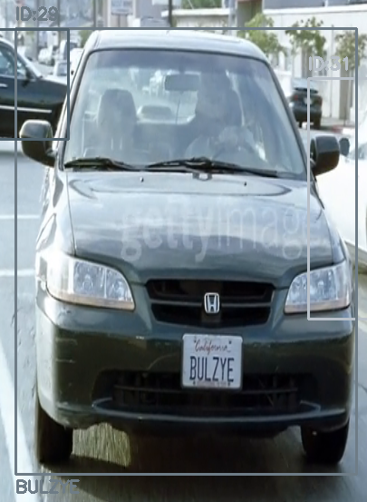

## Запуск програми виконується за командою  

```bash
python t.py path_to_RTSPcamera
```

> **примітка:** при повторних запусках моделі працюють швидше завдяки кешуванню - *~10 FPS* при першому запуску та до **~35 FPS** при наступних.

## Приклад роботи
